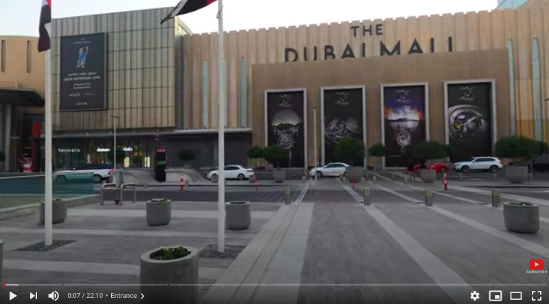

# Advanced Analytics
## FMCG
## Dec 17, 2020
## Author RIHAD

For the retail industry, the global pandemic creates a new digital paradigm. For many in the industry, these represent truly unprecedented times

From video calls to *get everything you need on an app*, many of us have accelerated our adoption of new technology to the point where we can live our lives quite comfortably with little need to leave our homes

Certainly, with one-third of the world’s population still under some form of restrictions and many others now shifting the way they work and live, business offerings are going to be fundamentally reshaped in light of these profound structural changes

But it doesn’t necessarily mean that everything is about to change. Customers may be able to opt for an online experience because it is necessary – but is it actually what they want? After a period of enforced social isolation, humans are desperate to reconnect with each other and forge those critical human links once again

Indeed, for businesses, these twin shifts, of digital acceleration and a renewed desire for connections, *present unique opportunities for future-proofing*. From the omnichannel revolution to the rise of e-sports, it is a time to rethink models and reimagine the retail sector for a new era

### with every challenge – a solution
Firstly, it’s important to acknowledge the hurdles facing physical retail stores and leisure facilities globally due to necessary, ongoing restrictions

Governments and policymakers around the world are grappling with the need to protect health at the same time as restarting their economies. In pursuit of these goals, they have established a raft of regulations to safeguard the social and financial well-being of their citizens and residents. Many of these regulations have impacted the retail industry with scores of brick-and-mortar assets being closed for a length of time

These closures have accelerated trends that were already on the rise pre-pandemic – beginning with the exponential surge in online retail. According to pollster Ipsos, economies in the Middle East and North Africa (MENA) region – including the UAE, Saudi Arabia, Lebanon, and Morocco – have experienced double-digit growth in people turning to e-commerce for products they would have previously bought in-store

But even before the pandemic, the MENA region was ranked as one of the world’s fastest-growing e-commerce markets, particularly the Gulf Cooperation Council (GCC) states. This trend is positive news for brick-and-mortar retailers who are increasingly integrating their physical and digital offerings for consumers

We call it a ‘physical’ experience, and it represents a compelling opportunity to create a seamless omnichannel experience by marrying the online and offline world for the benefit of customers

E-commerce isn’t the only retail channel that’s seen a spike in uptake. The convenience of Buy Online Pick Up in Store (BOPIS) has also seen explosive growth. For customers, BOPIS provides control of when and where customers pick up their online orders. For the retailer, it brings customers into stores, where they might purchase other products, while also helping to manage inventory levels

In our view, the critical gateway to success in omnichannel is the *customer interface*. MENA markets including the UAE and Saudi Arabia, boast some of the world’s highest rates of smartphone ownership, making a well-designed app a must. From pre-booking a restaurant to smart parking, apps can make omnichannel seamless – a quality it must have. But it also requires ‘newness’

This is the guiding principle behind Majid Al Futtaim’s latest concept store, *THAT*. The concept store which blends fashion, wellness, beauty, and culture and which has opened in Mall of the Emirates in October 2020, has created a mirror image in its digital app that was launched in June, alongside an immersive pop-up store. The app engages more precisely with THAT’s target millennial mindset consumer – finding out what’s working and what needs improvement – while simultaneously bringing new footfall into a carefully curated retail space for those who want to discover more. It is a ‘physical’ experience in every sense of the word

### diversified offering
Embracing the transformative possibilities of digital is not only about re-vitalizing shopping. Over two decades ago the American sociologist George Ritzer coined the term ‘retailtainment’ which was defined as reinventing retail spaces as places for experiences

If we take this concept further, we have found that you can combine the excitement of an adrenaline-charged virtual offering with masses of space – a commodity which malls have plenty of. In the Mall of the Emirates, they now have the VR experience, Dreamscape, which enables its customers to interact with whales, dinosaurs, and all kinds of virtual beings while still being inside a mall

Another exciting piece in this jigsaw is e-sports – gaming experiences regarded by analysts as among the fastest-growing in the entertainment sector. In North America, the 520-store Mall of America is fast becoming an entertainment destination, while Malaysia now boasts a 17,000 square foot gaming arena within a mall

Likewise, at Majid Al Futtaim, it has identified spaces in its malls that can be turned into e-gaming lounges to build authentic connections with teens and young adults. With a focus on both vintage-era games as well as futuristic models that cater to the growing VR trend, it has seen the benefit of transforming physical spaces into virtual leisure hubs that offer a range of shared experiences for their customers. Around the world, these trends are already underway

>This is because individuals and businesses know that when you combine a seamless omnichannel experience with a memorable, shared experience, you have a winning formula

### time for optimism
So how do we feel about the coming months? Undoubtedly, the period will be tough for consumers and businesses alike. And yet we remain optimistic about the opportunities that the technological acceleration of the pandemic is helping to realize within the retail sector

We strongly believe that shopping malls – which are in essence experience hubs - will continue to be a destination for people to shop, eat, and play. They are spaces that people will throng to when they meet family and friends. And they continue to provide people with a sensorial experience that we crave, despite the convenience of online. There are so many aspects that a mall provides in terms of food, wellness, art, culture, social engagement, that we find intrinsic to human behaviour, which simply cannot be substituted with a purely online experience, no matter how efficient that may be

Businesses must evolve – that is the nature of the beast. And by investing in and embracing the co-existence of both digital and physical platforms, we can ensure the resurgence of the retail sector which plays a pivotal role in driving job creation, fostering innovation, and enhancing the urban fabric of our markets
