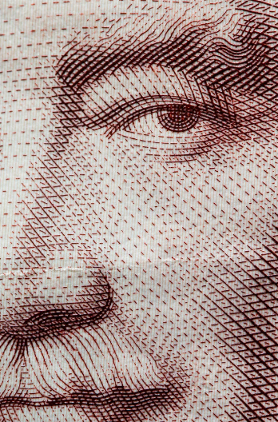

## The World...
## Dec 08, 2020
## Author RIHAD

Modern-day concepts of "intelligence" and "meritocracy" appear to be based on a single test-taking metric. Those who excel at test-taking gain entrance into purported "elite" institutions and thus have a "moral" and "merit" based mandate to lead. Yet strong reality-based evidence suggests those with superior test-taking ability are NOT most fit to command public and private firms. Real-world experience casts doubt on current notions of "meritocracy" and the modern-day leadership class has lost the mandate of the heavens. Many august institutions are becoming dysfunctional and the rot unacceptable

The idea that superior test-taking ability is a true measure of superior "intelligence" has failed. Modern science has detected many different forms of intelligence and exposes the inability to define or measure a single metric of intelligence. Recent work in artificial intelligence suggests new forms of intelligence not accessible to human creation or understanding. Moreover, the theory that a single metric of "intelligence" can define "meritocracy" to select an elite leadership class was always a dubious proposition that reality has falsified

We all know that true merit is earned from real-world achievement. The fraudulent meritocracy we have today has produced suboptimal leadership. We need a different method to select our leaders in both public and private institutions. We deserve better

What is to be done?
