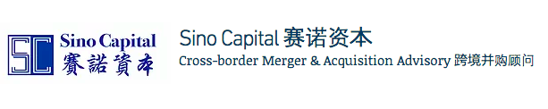

Sino Capital is an investment banking firm focusing on Cross-border Merger & Acquisition (“M&A”) Services. Our services include cross-border M&A advisory, fund raising, loan arrangement, and company restructuring

The team has extensive experience and is highly qualified on advising clients on corporate finance matters. We are here to assist our clients achieving their strategic and financing goals by providing professional and tailor-made service

## Cross-border Merger & Acquisition
Sino assists clients with our one-stop-shop solution from locating a shortlist of potential buyers / suitable targets, to facilitating negotiation, Due-Diligence, to  closing the deal  at conditions to client’s satisfaction. With over 20 year’s extensive experience, strong connections in the Great China Region and sufficient capital from our investor, we can also arrange financing or introduce co-investors to support our client’s M&A activities. We also have extensive international coverage to help our clients in sourcing targets especially in Europe and Asia Pacific

## Corporate Restructuring
Sino assists clients in reorganizing corporate structure to maximize their business efficiency and to facilitate financial activities including overseas listings, overseas loan financing as well as doing overseas business and corporate development

## Post Merger & Acquisition
Sino provides professional post-acquisition consultancy services to assist the acquirer to integrate with the target company, by providing solutions and services in areas including financial, accounting and operational aspects on an ongoing basis

## Loan Arrangement
Sino assists clients in arranging overseas loans or syndicated bank loans. From restructuring organizations, terms discussions to arranging loans, we provide professional and tailor-made services for clients to fully benefit from the best borrowing terms

## PE Funding
Sino assists clients with the whole transaction by utilizing our rich experience and in-depth connection with reputable PE funds. We also work on Management Buyouts (MBO) and Leverage Buyouts (LBO)
