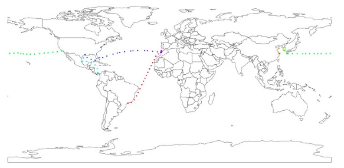
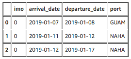
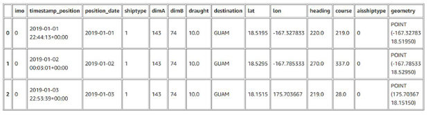
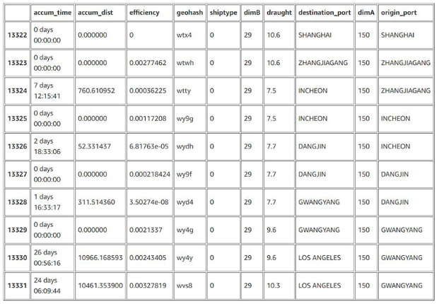
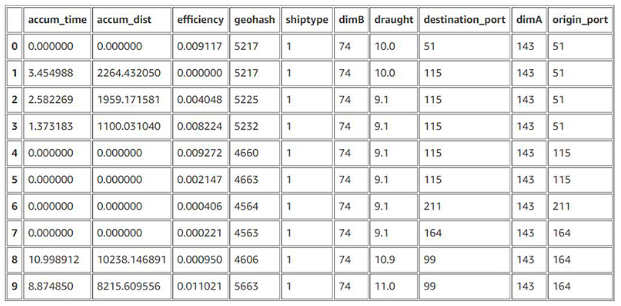
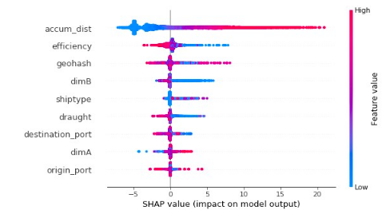

## Predict ship time of arrival
## Jan 26, 2021
## by RIHAD VARIAWA and SAMIRA VARIAWA
### Artificial Intelligence


According to the International Chamber of Shipping, 90% of world commerce happens at sea. Ships are transporting every possible kind of commodity, including raw materials, semi-finished and finished goods, making ocean transportation a key component of the global supply chain. Manufacturers, retailers, and the consumer are reliant on hundreds of thousands of ships carrying freight across the globe, delivering their precious cargo at the port of discharge after navigating for days or weeks

As soon as a ship arrives at its port of call, off-loading operations begin. Bulk cargo, containers, and vehicles are discharged. Complex land-side operations are triggered by cargo off-loading, involving multiple actors. Terminal operators, trucking companies, railways, customs, and logistic service providers work together to make sure that goods are delivered according to a specific SLA to the consignee in the most efficient way

### Business problem

Shipping companies publicly advertise their vessels’ *estimated time of arrival* (ETA) in port, and downstream supply chain activities are planned accordingly. However, delays often occur, and the ETA might differ from the vessel’s *actual time of arrival* (ATA), for instance due to technical or weather-related issues. This impacts the entire supply chain, in many instances reducing productivity and increasing waste and inefficiencies

>Predicting the exact time a ship arrives in a port and starts off-loading operations poses remarkable challenges

Today, a majority of companies rely on experience and improvisation to respectively guess ATA and cope with its fluctuations. ***Very few service providers are leveraging Artificial intelligence to scientifically predict ETA and help create better planning for their supply chain***

>In this post, we’ll predict the arrival time of ships at ports

### Experiment

ETA predictions are complex problems. *Similar to Air travel*. It involves a huge number of variables and a lot of uncertainty. Machine Learning is the tool for the job. However, it’s crucial to have a baseline metric (such as an expert user or a rule-based engine) to compare the performance and understand if your model is good enough

Our experiment is the challenge of accurately predicting the ship's ETA. It’s not a complete solution, but it can be seen as a guide to implement a sound and complete model, based on historical data. Our solution includes the following high-level steps:

1. Reduce the problem to a single ship voyage (when the ship departs from one given port and gets to another)
2. Explore a temporal dataset
3. Identify the spatiotemporal aspects in the checkpoints sent by each ship
4. From a given checkpoint, predict the ETA in days for the ship to reach the destination port

The following shows multiple ship voyages of the same vessel in different colors



### Methodology

Vesseltracker (a Wood Mackenzie Business), focused on maritime transportation intelligence, shared with us a sample of the historical data they collect from ships (checkpoints) and ports (port calls) every day. The checkpoints contain the main characteristics of each ship, plus their current geoposition, speed, direction, draught, and more. The port calls are the dates and times of each ship’s arrival or departure

As we are training a ML model to predict continuous values, we experimented with some regression algorithms like XGBoost, Random Forest, and MLP Regressor. At the end of the experiments (including hyperparameter optimization), we opted for the Random Forest Regressor, given it gave us a better performance

To train a regressor, we had to transform the data and prepare one feature to be the label, in this case, the number of days (float) that the vessel takes to get to the destination port

For feature engineering, it’s important to highlight the following steps:

1. Identify each ship voyage in the dataset. Join with the port calls to mark the departure and the arrival checkpoints
2. Compute backward from the destination port to the departure port the accumulated time per checkpoint
3. Apply any geo-hashing mechanism to encode the GPS (latitude, longitude) and transform it into a useful feature
4. Compute the great-circle distance between each sequential pair of geopositions from checkpoints
5. As the ship changes speed over time, we need to compute a new feature (called efficiency) that helps the model ponder the ship displacement (speed and performance) before computing the remaining time
6. Use the data of all voyages and the great-circle distance between each checkpoint to create an in-memory graph that shows us all the paths and distances between each segment (checkpoints)

With this graph, we compute the distance between the current position of the ship and the destination port. This process resulted in a new feature called *accum_dist*, or accumulated distance. As the feature importance analysis shows, because this feature has a high linear correlation with the target, it has a higher importance to the model

#### Dataset

The following tables show samples of the data we used to create the dataset. The port calls (shown in the first table) are expressed by a few attributes from the ship, the port identification, and timestamps of the arrival and departure events



Then we have the checkpoints. A checkpoint is a message sent by each ship at a frequency X (in this case, approximately 1 day) that contains information about the ship itself and its current position. By joining both tables, we enrich the checkpoints with information about the departure and arrival, which is crucial to enclose all the other checkpoints sent between these two events. The following table is an example of ship checkpoint data



In the next table, both tables are joined and cleaned, with the geolocation encoded and the accumulated time and distance calculated. This view is for one particular ship, which shows all the checkpoints that belong to one given voyage



Finally, we have the dataset used to train our model. The first column is the label or the target value our model tries to create a regression. The rest of the columns are the features the decision tree uses during training



### Model and Results

After preparing the data, it’s time to train our model. We used a technique called k-fold cross validation to create six different combinations of training and validation data (approximately 80% and 20%) to explore the variation of the data as much as possible

```
rf = RandomForestRegressor(
        n_estimators=est, verbose=0, n_jobs=4, criterion='mse',
        max_leaf_nodes=1500, max_depth=depth, random_state=0
    )
```

After training our model, we used a metric called R^2 to evaluate the model performance. R^2 measures the proportion of the variance in the dependent variable that is predictable from the independent variables. *A poor model has a low R^2 and a useful model has an R^2 as close as possible to 1.0*

In this case, we expected a model that predicted values with a high level of correlation with the testing data. With this combination of data preparation, algorithm selection, and hyperparameters optimization and cross validation, our model achieved an R^2 score of 0.9473

This result isn’t bad, but it doesn’t mean that we can’t improve the solution. We can minimize the accumulated error by the model by adding important features to the dataset. These features can help the model better understand all the low-level nuances and conditions from each checkpoint that can cause a delay. Some examples include weather conditions from the geolocation of the ship, port conditions, accidents, extraordinary events, seasonality, and holidays in the port countries

Then we have the feature importance (shown in the following graph). It’s a measurement of how strong or important a given feature from the dataset is for the prediction itself. Each feature has a different importance, and we want to keep only those features that are impactful for the model in the dataset



The graph shows that accumulated distance is the most important feature (which is expected, given the high correlation with the target), followed by efficiency (an artificial feature we created to ponder the impact of the ship displacement over time). In third place, we have destination port, closer to the encoded geoposition

### Conclusion

The use of ML in predicting ship time of arrival can substantially increase the accuracy of land-side operations planning and implementation, in comparison to traditional, manual estimation methodologies that are used widely across the industry. If your company is interested in learning more about our model and how it can be consumed, do reach out  rihad.2series@outlook.com


