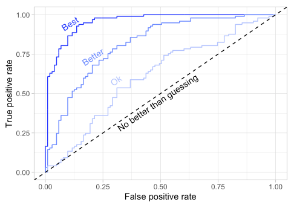

## High-quality financial models
## Feb ??, 2021
## by RIHAD VARIAWA and SAMIRA VARIAWA
### Artificial Intelligence


https://aws.amazon.com/blogs/machine-learning/creating-high-quality-machine-learning-models-for-financial-services-using-amazon-sagemaker-autopilot/

Machine learning (ML) is used throughout the financial services industry to perform a wide variety of tasks, such as *fraud detection, market surveillance, portfolio optimization, loan solvency prediction, direct marketing*, and many others. This breadth of applications have created a need for business lines to quickly generate high-quality and performant models that can be produced with little to no code. This reduces the long cycles for taking use cases from concept to production and generates business value. In this post, we explore a common use case in the financial services industry, *credit card fraud detection*

Seasoned Data scientists in financial services often work on tasks where the datasets are highly imbalanced (heavily skewed towards examples of one class). Examples of such tasks include *credit card fraud* (where a very small fraction of the transactions are actually fraudulent)

Artificial intelligence allows us to tune models using the Area Under a Curve (AUC) metric in addition to F1 as the objective metric (which is the default objective for binary classification tasks), more specifically the area under the Receiver Operating Characteristic (ROC) curve. Using the AUC as the model evaluation metric for highly imbalanced data allows us to generate high-quality models

## Workflow

* Create an AWS Identity and Access Management (IAM) role that allows the SageMaker access to Amazon Simple Storage Service (Amazon S3) for storing data
* Create an Amazon SageMaker notebook instance
* Create an S3 bucket to store the outputs of our ML models and data

## Credit card fraud detection

>In fraud detection tasks, companies are interested in maintaining a very low false positive rate while correctly identifying the fraudulent transactions to the greatest extent possible. A false positive can lead to a company canceling or placing a hold on a customers’ card over a legitimate transaction, which leads to a poor customer experience. As a result, accuracy is not the best metric to consider for this problem; better metrics are the AUC and the F1 score

## dataset

Obtained from EU cardholders, contains data that occurred over a two day period. All variables are numerical. The data has been transformed using PCA transformation(s) due to privacy reasons. The 3 attributes that have not been transformed are:

* Time - seconds elapsed between transactions
* Amount - transaction amount
* Class - response variable

The following code shows data for a credit card fraud task:

```
import pandas as pd
df = pd.read_csv('creditcard.csv')
df.head()
```


Class 0 and class 1 correspond to *genuine* or *fraudulent* accordingly. As we can see, other than Amount, other columns are anonymized. A key differentiator of Ai is its ability to process raw data directly, without the need for data processing on the part of data scientists. For example, Autopilot automatically converts categorical features into numerical values, handles missing values (as we show in the second example), and performs simple text preprocessing

Using the AWS boto3 API, we upload the data in CSV format:

```
import boto3
s3 = boto3.client('s3')
s3.upload_file(file_name, bucket, object_name=None)

df = pd.read_csv(<your S3 file location>)
```

Now, we select all columns except Class as features as Class is our target:

```
X = df[set(df.columns) - set(['Class'])]
y = df['Class']
print (y.value_counts())

0    284315
1       492
```

The binary label column Class is highly imbalanced, which is a typical occurrence in financial use cases. We can verify how well Ai handles this highly imbalanced data

In the following code, we demonstrate how to configure Ai in Jupyter notebooks. We have to provide train and test files, and to set TargetAttributeName as Class, this is the target column (the column we predict):

```
auto_ml_job_name = 'automl-creditcard-fraud'
import boto3
sm = boto3.client('sagemaker')
import sagemaker  
session = sagemaker.Session()

prefix = 'sagemaker/' + auto_ml_job_name
bucket = session.default_bucket()
training_data = pd.DataFrame(X_train)
training_data['Class'] = list(y_train)
test_data = pd.DataFrame(X_test)

train_file = 'train_data.csv';
training_data.to_csv(train_file, index=False, header=True)
train_data_s3_path = session.upload_data(path=train_file, key_prefix=prefix + "/train")
print('Train data uploaded to: ' + train_data_s3_path)

test_file = 'test_data.csv';
test_data.to_csv(test_file, index=False, header=False)
test_data_s3_path = session.upload_data(path=test_file, key_prefix=prefix + "/test")
print('Test data uploaded to: ' + test_data_s3_path)
input_data_config = [{
      'DataSource': {
        'S3DataSource': {
          'S3DataType': 'S3Prefix',
          'S3Uri': 's3://{}/{}/train'.format(bucket,prefix)
        }
      },
      'TargetAttributeName': 'Class'
    }
  ]
```

For this post, we set ProblemType='BinaryClassification' and job_objective='AUC'. If you don’t set these fields, Ai automatically determines the type of supervised learning problem by analyzing the data and uses the default metric for that problem type. The default metric for binary classification is F1. We explicitly set these parameters because we want to optimize AUC

```
from sagemaker.automl.automl import AutoML
from time import gmtime, strftime, sleep
from sagemaker import get_execution_role

timestamp_suffix = strftime('%d-%H-%M-%S', gmtime())
base_job_name = 'automl-card-fraud'

target_attribute_name = 'Class'
role = get_execution_role()
automl = AutoML(role=role,
                target_attribute_name=target_attribute_name,
                base_job_name=base_job_name,
                sagemaker_session=session,
                problem_type='BinaryClassification',
                job_objective={'MetricName': 'AUC'},
                max_candidates=100)  
```

After the job is created, we call the fit() function to train the model:

```
automl.fit(train_file, job_name=base_job_name, wait=False, logs=False)
describe_response = automl.describe_auto_ml_job()
print (describe_response)
job_run_status = describe_response['AutoMLJobStatus']

while job_run_status not in ('Failed', 'Completed', 'Stopped'):
    describe_response = automl.describe_auto_ml_job()
    job_run_status = describe_response['AutoMLJobStatus']
    print (job_run_status)
    sleep(30)
print ('completed')
```

When the job is complete, we can select the best candidate based on the AUC objective metric:

```
best_candidate = automl.describe_auto_ml_job()['BestCandidate']
best_candidate_name = best_candidate['CandidateName']
print("CandidateName: " + best_candidate_name)
print("FinalAutoMLJobObjectiveMetricName: " + best_candidate['FinalAutoMLJobObjectiveMetric']['MetricName'])
print("FinalAutoMLJobObjectiveMetricValue: " + str(best_candidate['FinalAutoMLJobObjectiveMetric']['Value']))
CandidateName: tuning-job-1-7e8f6c9dffe840a0bf-009-636d28c2
FinalAutoMLJobObjectiveMetricName: validation:auc
FinalAutoMLJobObjectiveMetricValue: 0.9890000224113464
```

We now create the ML model object using the model artifacts from the job in Amazon S3, and the inference container from the best candidate after running the tuning job. In addition to the predicted label, we’re interested in the probability of the prediction, *we use this probability later to plot the AUC and precision and recall graphs*

```
model_name = 'automl-cardfraud-model-' + timestamp_suffix
inference_response_keys = ['predicted_label', 'probability']
model = automl.create_model(name=best_candidate_name,
candidate=best_candidate,inference_response_keys=inference_response_keys)
```

After the model is created, we can generate inferences for the test set using the following code. During inference time, Ai orchestrates deployment of the inference pipeline, including feature engineering and the algorithm on the inference machine

```
s3_transform_output_path = 's3://{}/{}/inference-results/'.format(bucket, prefix);
output_path = s3_transform_output_path + best_candidate['CandidateName'] +'/'
transformer=model.transformer(instance_count=1,
                          instance_type='ml.m5.xlarge',
                          assemble_with='Line',
                          output_path=output_path)
transformer.transform(data=test_data_s3_path, split_type='Line', content_type='text/csv', wait=False)

describe_response = sm.describe_transform_job(TransformJobName = transform_job_name)
job_run_status = describe_response['TransformJobStatus']
print(job_run_status)

while job_run_status not in ('Failed', 'Completed', 'Stopped'):
    describe_response = sm.describe_transform_job(TransformJobName = transform_job_name)
    job_run_status = describe_response['TransformJobStatus']
    print (describe_response)
    sleep(30)
print('transform job completed with status : ' + job_run_status)
```

Finally, we read the inference and predicted data into a dataframe:

```
import json
import io
from urllib.parse import urlparse

def get_csv_from_s3(s3uri, file_name):
    parsed_url = urlparse(s3uri)
    bucket_name = parsed_url.netloc
    prefix = parsed_url.path[1:].strip('/')
    s3 = boto3.resource('s3')
    obj = s3.Object(bucket_name, '{}/{}'.format(prefix, file_name))
    return obj.get()["Body"].read().decode('utf-8')    
pred_csv = get_csv_from_s3(transformer.output_path, '{}.out'.format(test_file))
data_auc=pd.read_csv(io.StringIO(pred_csv), header=None)
data_auc.columns= ['label', 'proba']
```

## Model metrics
Common metrics to compare classifiers are the ROC curve and the precision-recall curve. The ROC curve is a plot of the true positive rate against the false positive rate for various thresholds. The higher the prediction quality of the classification model, the more the ROC curve is skewed toward the top left



The precision-recall curve demonstrates the trade-off between precision and recall, with the best models having a precision-recall curve that is flat initially and drops steeply as the recall approaches 1. The higher the precision and recall, the more the curve is skewed towards the upper right.

To optimize for the F1 score, we simply repeat the steps from earlier, setting the job_objective={'MetricName': 'F1'} and rerunning the Autopilot job. Because the steps are identical, we don’t repeat them in this section. Please note, F1 objective is default for binary classification problems. The following code plots the ROC curve:

```
import matplotlib.pyplot as plt
colors = ['blue','green']
model_names = ['Objective : AUC','Objective : F1']
models = [data_auc,data_f1]
from sklearn import metrics
for i in range(0,len(models)):
    fpr, tpr, _ = metrics.roc_curve(y_test, models[i]['proba'])
    fpr, tpr, _  = metrics.roc_curve(y_test, models[i]['proba'])
    auc_score = metrics.auc(fpr, tpr)
    plt.plot(fpr, tpr, label=str('Auto Pilot {:.2f} '+ model_names[i]).format(auc_score),color=colors[i])

plt.xlim([-0.1,1.1])
plt.ylim([-0.1,1.1])
plt.ylabel('True Positive Rate')
plt.xlabel('False Positive Rate')
plt.legend(loc='lower right')
plt.title('ROC Cuve')
```

The following plot shows the results.


In the preceding AUC ROC plot, Autopilot models provide high AUC when optimizing both objective metrics. We also didn’t select any specific model or tune any hyperparameters; Autopilot did all that heavy lifting for us.

Finally, we plot the precision-recall curves for the trained Autopilot model:

```
from sklearn.metrics import precision_recall_curve
from sklearn.metrics import f1_score, precision_score, recall_score
from sklearn.metrics import plot_precision_recall_curve
import matplotlib.pyplot as plt
from sklearn import metrics

colors = ['blue','green']
model_names = ['Objective : AUC','Objective : F1']
models = [data_auc,data_f1]

print ('model ', 'F1 ', 'precision ', 'recall ')
for i in range(0,len(models)):
precision, recall, _ = precision_recall_curve(y_test, models[i]['proba'])
print (model_names[i],f1_score(y_test, np.array(models[i]['label'])),precision_score(y_test, models[i]['label']),recall_score(y_test, models[i]['label']) )
plt.plot(recall,precision,color=colors[i],label=model_names[i])

plt.xlabel('Recall')
plt.ylabel('Precision')
plt.title('Precision-Recall Curve')
plt.legend(loc='upper right')
plt.show()

                    F1          precision      recall
Objective : AUC 0.8164          0.872          0.7676
Objective : F1  0.7968          0.8947         0.7183
```

The following plot shows the results.


As we can see from the plot, Autopilot models provide good precision and recall, because the graph is heavily skewed toward the top-right corner.
