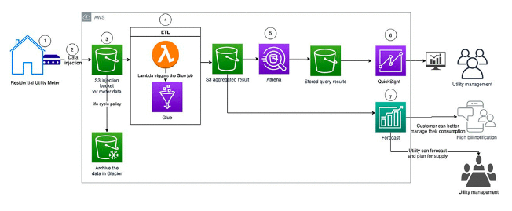
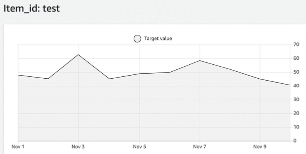
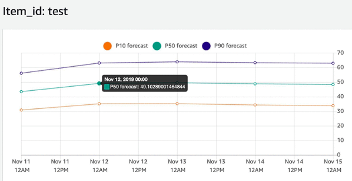
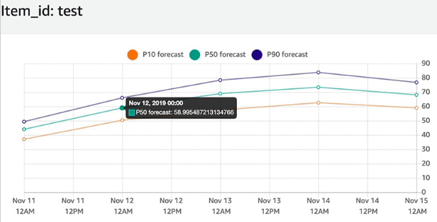
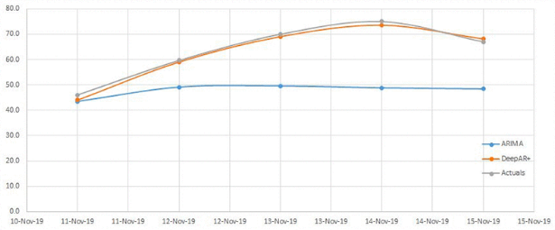

## Forecasting Energy Consumption
## Jan 31, 2021
## by RIHAD VARIAWA
### Artificial Intelligence

Power utility providers have several forecasting use cases, but primary among them is *predicting energy consumption* both at the customer and aggregate level. *Predicting energy consumption* accurately is critical so customers do not face any service interruptions and to provide a stable grid system while maintaining low prices

We use Machine Learning (ML) to generate highly accurate forecasts. Forecasts are applicable in a wide variety, including *energy demand forecasting, estimating product demand, workforce planning, and computing cloud infrastructure usage*

>To use ML we need to provide historical data for what we want to forecast, and, optionally, any additional data that we believe may impact our forecasts. This related data may include both time-varying data, such as price, events, and weather, and categorical data, such as color, genre, or region

Most Power utilities have the data they need to make these types of forecasts, but it’s often locked away in separate incompatible data silos. Utilities often have a variety of tools deployed for forecasting, the most widely being Excel. Usually only a handful of staff are using advanced analytic tools though, and even fewer utilities have data scientists who may have used ML to build artificial intelligence (Ai) models for the utility. This post explores ML to address this challenge by combining historical time series data with critical exogenous variables such as weather

## Overview of solution

Accurate energy forecasting is critical to make sure that utilities can run day-to-day operations efficiently. Energy forecasting is particularly challenging because demand is dynamic, and seasonal weather changes can have an impact. The following are the two most common challenges:

* **Power consumption forecast at a consumer level** –> In many countries, power is provided in competitive retail markets. Consumers have a choice in buying electricity and can switch providers if they receive high energy bills or have a bad customer experience. As a utility provider, you can reduce customer churn by improving customer service and proactively reaching out with future bill spend alerts. These alerts are based on accurately predicting electricity consumption at an individual customer level
* **Power consumption forecast at an aggregate level to better manage supply and demand** –> As a utility provider, you must balance aggregate supply and demand. You often have to generate energy to meet peak demand or sell excess capacity in the spot market. Moreover, demand forecasting has become more challenging with the following:

 + The introduction of renewable energy resources, such as solar and wind. These are owned both by utilities and end consumers, are subject to weather changes, and do not produce stable power at all times

 + The rise of electric vehicle purchases and the unknown nature of when vehicle owners want to charge them at home. Improved forecasting enables planning ahead to structure more cost-effective futures contracts

>This post focuses on a solution for the first challenge, ***at the consumer level***

### Prerequisites

The first step is to set up and prepare our data. ***Data lakes have proven to be revolutionary for utilities***. A data warehouse is a repository for structured and filtered data that has already been processed for a specific purpose. In contrast, a ***data lake*** is a single store of raw data for an organization, containing schema-less versions of all data that can be analyzed. This is very valuable for a power utility company that collects, stores, and processes meter readings from millions of customers

## Solution architecture

The following diagram illustrates the architecture to implement bill alerts to customers

The labels in our architecture are as follows:

1. Utility meters in residential homes typically record energy hourly or more frequently, report at least daily to the utility company
2. We can implement data ingestion via various channels. If we collect the data in an on-premises data center, we can send the data to AWS via AWS Direct Connect. If the meters have IoT capability, we can send the data to AWS IoT Core via an MQTT topic. MQTT is a machine-to-machine (M2M)/IoT connectivity protocol. It was designed as an extremely lightweight publish and subscribe messaging transport. It is useful for connections in remote locations that require a small code footprint or in which network bandwidth is at a premium
3. We use Amazon S3 to store the raw meter data. The Amazon S3-based data lake solution uses Amazon S3 as its primary storage platform. Amazon S3 provides an optimal foundation for a data lake because of its unlimited scalability. We can increase storage from gigabytes to petabytes seamlessly and pay only for what we use. Amazon S3 is designed to provide 99.999999999% durability. We can put a lifecycle policy in place to archive the data into Amazon S3 Glacier, which is more cost-effective
4. Ingested data lands in an S3 bucket called the raw zone. When the data is available, an Amazon S3 trigger invokes an AWS Lambda function, which processes and moves the data into another S3 bucket called the processed zone
5. We can query the data in Amazon S3 via Amazon Athena. *Athena is an interactive query service that makes it easy to analyze data directly in Amazon S3 using standard SQL*. Athena automatically stores query results and metadata information for each query that runs in a query result location, which we can specify in Amazon S3
6. We can access the query result bucket with Amazon QuickSight. *Amazon QuickSight is a business analytics service we use to build visualizations, perform ad hoc analysis, and get business insights from our data*
7. We use the processed data from Amazon S3 to make predictions with Forecast. **Residential customers can use these results to see future energy consumption, which allows them to calculate energy costs and move to a more efficient pricing plan or modify future usage as needed**. We use the Query API and integrate it with our mobile or web application to provide customers visibility into future demand and help drive consumption

## ML workflow

>This post evaluates two different approaches to forecasting energy consumption at the individual customer level, one without related time series information and another with related time series data

In forecasting problems, related time series are variables (such as weather or price) that correlate with the target value and lend statistical strength to a forecast on the target value (i.e. energy demand). More precisely, Forecast treats related time series as exogenous variables. These variables are not a part of the model specification, but we use them to capture the correlation between the current value of the related time series with the corresponding value of the target time series

You might not always improve accuracy by incorporating related time series. Therefore, we have to base any addition of related time series on backtesting to check if the overall accuracy is either improved or unchanged with the addition of the same. ML doesn’t require a related time series, but it does require target time series. If a related time series has missing values or other quality issues, it might be better to not include the same to avoid introducing noises to the model. Essentially, to decide which related time series is useful or how to use them effectively is a key feature engineering task

## Energy consumption forecast model with ARIMA

Autoregressive Integrated Moving Average (ARIMA) is a classic statistical model for time series. It uses past data to explain the future by expressing the time series values with a linear combination of its lagged values and forecast errors. We use ARIMA with an autoregressive integrated moving average with explanatory variable (ARIMAX) model, or without related time series or regression variables. When we apply ARIMA models, it can be difficult to choose the proper model order, which is a manual and subjective process. Using Ai, we use auto.arima to automatically find the ARIMA model that best suited for the data

The input data used is individual energy consumption data. It is a CSV file with three attributes: `CustomerID`, `Date`, and `Energy consumption amount`. The energy consumption amount is in kWh (kilowatt hours). Our use case involved 557 days of daily historical data, but you could easily use hourly data, which is more common in the industry

The following shows an example of our customer data: electricity_individual.csv

| V1      | V2             | V3      |
| :------ | :----------- | :-------- |
| test    | 2019-11-01   | 50.745    |
| test    | 2019-11-02   | 48.674    |
| test    | 2019-11-03   | 61.982    |
| test    | 2019-11-04   | 48.512    |
| test    | 2019-11-05   | 49.964    |
| test    | 2019-11-06   | 50.562    |
| test    | 2019-11-07   | 60.281    |
| test    | 2019-11-08   | 50.324    |
| test    | 2019-11-09   | 40.428    |

The following graph is a visualization of the data

## AWS Workflow

1. Create dataset group
2. Provide a name and forecasting domain
3. Specify the target time series dataset:
      a. `Item_id` is the utility <CustomerID>
      b. `timestamp` is the date <YYYY-MM-DD>, which is the daily consumption data
      c. `Target_value` is the energy consumed
4. Create an import job to import historical data. Make sure that the IAM role has access to the S3 bucket where the CSV file is uploaded
5. After we import the data, the status of the target time series data should be active
6. On the Dashboard, under Train a predictor, choose Start
7. For the algorithm, use ARIMA
8. When the predictor training is complete, the status on the dashboard shows as active
9. Create the forecast

After successfully creating the forecast, we query it for a specific customer ID or run an export job to generate the results for all customer IDs. The following shows the forecast energy consumption for the ID `test`

Although this walkthrough didn’t include factors like temperature, this is an excellent way to get started and establish a baseline model with the target time series data. Also, as a utility trying to meet aggregate supply and demand, we can potentially aggregate all the customer data and predict future consumption to plan supply accordingly

## Creating an energy consumption forecast model with DeepAR+

The Forecast DeepAR+ algorithm is a supervised learning algorithm for forecasting scalar (one-dimensional) time series using recurrent neural networks (RNNs). Classic forecasting methods, such as ARIMA or exponential smoothing (ETS), fit a single model to each individual time series. In contrast, DeepAR+ creates a global model (one model for all the time series) with the potential benefit of learning across time series

The DeepAR+ model is particularly useful when working with a large collection (over thousands) of target time series, in which certain time series have a limited amount of information. For example, to forecast the energy consumption of each household, global models such as DeepAR+ could use the statistical strengths of the more informative ones to better predict new households. Additionally, DeepAR+ can account for related time series, which can help improve our forecast

Here we add weather data, given its correlation to energy consumption

1. Update the dataset group by creating a new dataset import job. This model considered the following fields (apart from `timestamp` and `CustomerID`):

* `day_of_week`, V1
* `daily_average_dry_bulb_temperature`, V2
* `daily_cooling_degree_days`, V3
* `daily_departure_from_normal_average_temperature, V4
* `daily_average_normal_temp`, V5
* `daily_heating_degree_days`, V6
* `daily_maximum_dry_bulb_temperature`, V7
* `daily_minimum_dry_bulb_temperature`, V8
* `length_of_day_hours`, V9

The following table summarizes this data for Seattle (given that the customers in this dataset reside in that city) from a public weather source

| V1    | V2    | V3    | V4    | V5     | V6    | V7    | V8    | V9    |
|:----- |:----- |:----- |:----- |:------ |:----- |:----- |:----- |:----- |
| 7     | 53    | 0     | -3.1  | 56.1   | 12    | 60    | 46    | 15.03 |
| 1     | 55    | 0     | -1.3  | 56.3   | I0    | 60    | 49    | 15.08 |
| 2     | 51    | 0     | -5.5  | 56.5   | 14    | 55    | 47    | 15.12 |
| 3     | 50    | 0     | -6.7  | 56.7   | 15    | 53    | 46    | 15.15 |
| 4     | 53    | 0     | -3.9  | 51.5   | 12    | 60    | 46    | 15.02 |
| 5     | 57    | 0     | -0.1  | 56.9   | 08    | 64    | 50    | 15.25 |
| 6     | 62    | 0     | 4.7   | 57.1   | 03    | 73    | 50    | 15.28 |
| 7     | 64    | 0     | 6.5   | 57.3   | 01    | 72    | 56    | 15.32 |
| 1     | 64    | 0     | 6.3   | 57.5   | 01    | 76    | 51    | 15.35 |
| 2     | 69    | 4     | 11.1  | 51.7   | 00    | 82    | 55    | 15.04 |

2. Create a new predictor with the updated dataset
3. Generate a new model
4. Create a new forecast

The following shows the forecast energy consumption for the same `test` customer ID using the new model

We evaluate the results from the two models (ARIMA and DeepAR+) with the actual energy consumption over a forecast horizon of 5 days (November 11, 2019, to November 15, 2019)

To perform this evaluation, use the wQL[0.5]/MAPE metric. The calculated MAPE metric with ARIMA is 0.25, whereas the DeepAR+ model with weather data included has a MAPE of 0.04. The DeepAR+ model with weather helped improve model accuracy by 84%. The following table summarizes the details in this comparison

| Date        | ARIMA (kWh)  | DeepAR+ (kWh)  | Actual Energy Cons  |
| :---------- | :----------- | :------------- | :------------------ |
| 11/11/2019  | 43.5         | 44.1           | 46.0                |
| 11/12/2019  | 49.1         | 59.0           | 59.6                |
| 11/13/2019  | 49.5         | 69.0           | 70.0                |
| 11/14/2019  | 48,8         | 73.5           | 75.0                |
| 11/15/2019  | 48.4         | 68.1           | 67.0                |

The following graph visualizes the compared models

## Conclusion

This post discussed how we used ML and its underlying system architecture to predict individual customer energy demand using smart meter data. We enhanced model accuracy with DeepAR+ and weather data to achieve a forecast accuracy of approximately 96% (as determined by MAPE). If your company is interested in learning more about our model and how it can be consumed, do reach out  rihad.2series@outlook.com

