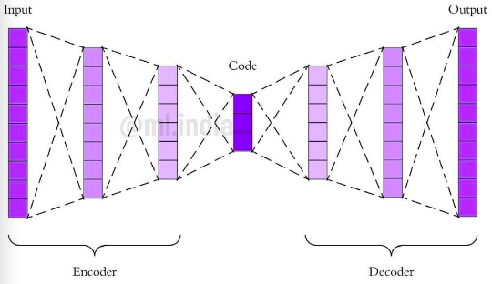

# Autoencoders
## Credit Card Fraud
## Dec 14, 2020
## Author RIHAD

## what are AutoEncoders and why are they used?
AEs are neural networks that learn how to find an encoding of data so that the input and the reconstruction of the encoding are close to each other

To construct an AE we need 3 components:

1. encoder - compress the input into a lower-dimensional code (the code is a compact *summary* or *compression* of the input)
2. decoder - reconstruct the input using the encoding of the input
3. loss function - for evaluating the performance of the model. The function measures how accurate the outputs of the NN are in comparison to the actual outputs (response values)

AE model tries to minimize the *reconstruction error* (RE), which is the mean squared distance between input and output  

## the Architecture
Both the encoder and decoder are ***fully-connected feed-forward NNs***. The code is a single layer with the dimensionality of our choice. The ***number of nodes*** in the code layer is a ***hyperparameter*** that we set before training the AE

 

## walk-through

The activation function converts the input and generates the output which will be used as input for the next layer. The activation function introduces non-linearity into the model, which helps in finding the complex pattern in the data

* First the input passes through the encoder, which is a fully-connected NN, to produce the code. The decoder then produces the output only using this code

* The goal is to ***get an output identical with the input*** Note that the decoder architecture is generally the mirror image of the encoder. *This is not a requirement but is typically the case*

* The only requirement is ***the dimensionality of the input and output needs to be the same*** Anything in the middle can be explored

* There are ***4 hyperparameter*** that  we need to set before training an AE:

1. code size
2. number of layers
3. number of nodes per layer
4. loss function

## denoising AEs  
Keeping the code layer ***small*** can force an AE to learn a ***low-dimensional intelligent representation*** of the data

There is another way to force the AE to learn useful variables, and that is **adding random noise to its inputs** and making it recover the original noise-free data

We are asking it to subtract the noise and produce the underlying meaningful data. *This is called a denoising AE*

## examples
>Here random Gaussian noise is aaded to the AE and the noisy data becomes the input to the AE

>The last row is the AE output. LOOKS PREETY GOOD!
